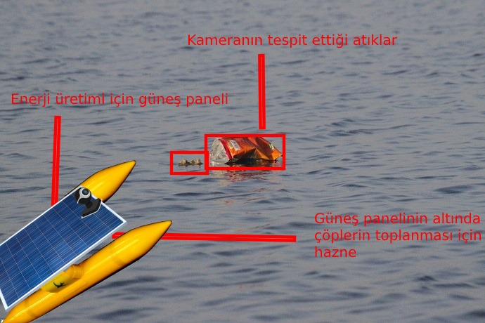
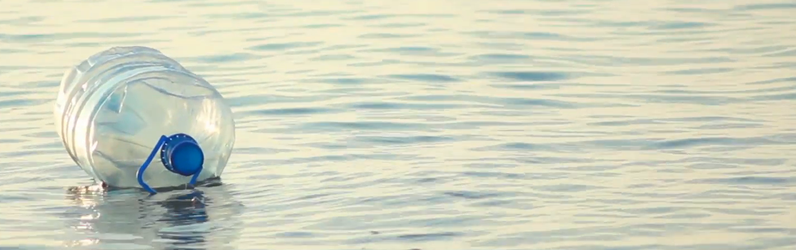
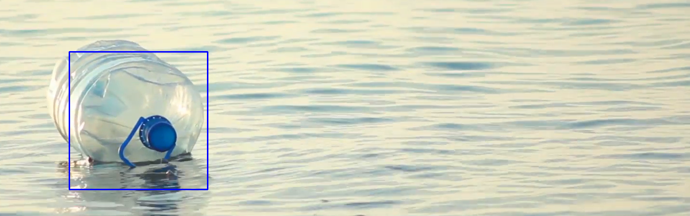

# Ezi Robot

Ezi robot denizlerdeki ve göllerdeki suyun üst kısmında yüzen plastikleri toplamak için geliştirmekte olduğumuz robottur.

Robotun  plastikleri tespit edip efektif bir plastik toplama işlemi gerçekleştirmesi için bir derin öğrenme modeli geliştirdik.



Geliştirdiğimiz model denizdeki çöpleri bulmakta başarılı oldu:




### Modeli denemek için yapmanız gerkenler

Öncelikle modeli eğitmek için plastik ve çeşitli çöp fotoğraflarına ihtiyacınız var. Internetten bulduğumuz 
[bu dataseti](https://drive.google.com/drive/folders/0B3P9oO5A3RvSUW9qTG11Ul83TEE) indirmelisiniz.

Ardından plastik-algilama klasöründen
```javascript
bash train.sh
```

komutunu çalıştırmanız gerekmektedir.

train.sh bulunduğunuz klasöre pre-trained bir model indirip ardından data klasöründeki fotoğraflarla modeli tekrardan eğitecektir.

Modeli eğittikten sonra:
```javascript
python find_object -i write_test.png
```

Komutuyla istediğiniz resmin içindeki çöpleri bulabilirsiniz.